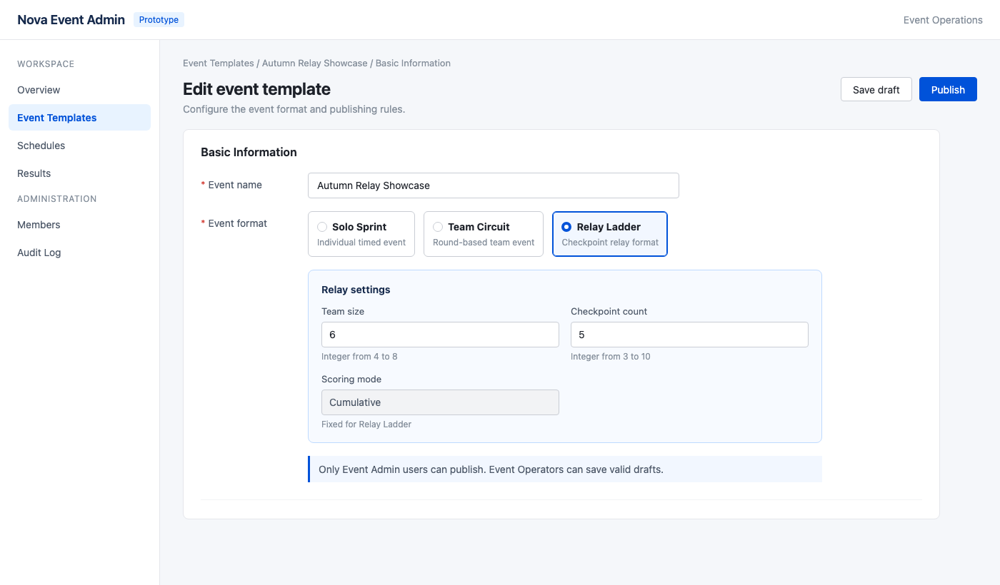

# Add Relay Ladder event format

## Background

Nova Event Admin currently supports Solo Sprint and Team Circuit but not checkpoint relay configuration.

## Goal

Allow Event Operators to configure valid Relay Ladder drafts and allow Event Admins to publish them.

## Requirements

| Sequence | Module | Prototype | Logic |
|---|---|---|---|
| 1 | <!-- requirement:REQ-NOVA-001 --> Basic Information |  | 1. **Added content** Add Relay Ladder to the Event format choices. 　a. **Trigger** Show Relay settings when Relay Ladder is selected. 　　i. **Field source** Team size uses 4–8, checkpoint count uses 3–10, and scoring mode is fixed to Cumulative. 2. **Validation** Require integer values within both configured ranges before saving a draft. |
| 2 | <!-- requirement:REQ-NOVA-002 --> Draft and Publish | No additional prototype | 1. **Trigger** Enable Save draft only after Relay settings pass validation. 　a. **Permission** Event Operators may save drafts; only Event Admins may publish. 2. **Boundary** Existing Solo Sprint and Team Circuit behavior remains unchanged. |

## Non-goals

Do not change Solo Sprint or Team Circuit behavior.
